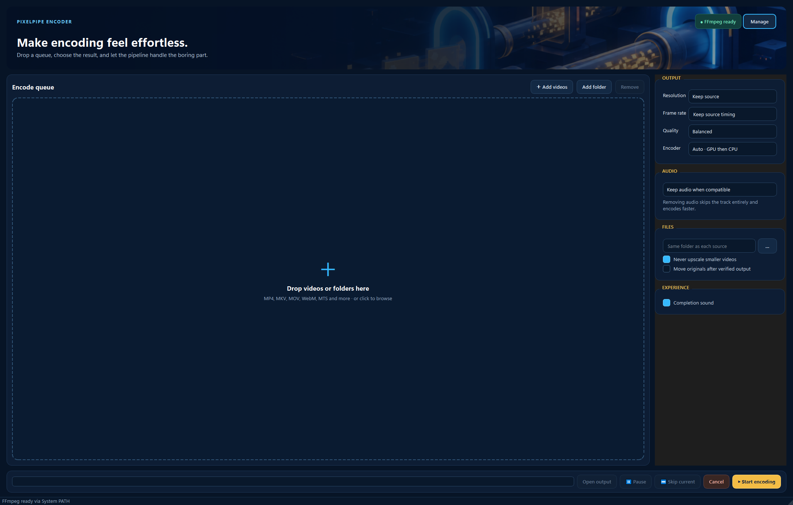

# PixelPipe Encoder

PixelPipe Encoder is a friendly Windows desktop video encoder that keeps the
boring parts of transcoding out of the way. Drop in videos or folders, choose
the result, and let the queue handle the rest.



## Download

Get the ready-to-use Windows builds from the
[latest GitHub release](https://github.com/mmahdighafoori10/PixelPipe-Encoder/releases/latest):

- **Installer:** guided per-user installation with Start Menu and uninstaller.
- **Portable ZIP:** extract the folder anywhere and run `PixelPipeEncoder.exe`.

The application is currently unsigned, so Windows SmartScreen may display an
`Unknown publisher` warning. Verify downloads against `SHA256SUMS.txt` in the
release before running them.

## Clone the source

```powershell
git clone https://github.com/mmahdighafoori10/PixelPipe-Encoder.git
cd PixelPipe-Encoder
```

GitHub also provides a source ZIP through **Code > Download ZIP**.

## Features

- Drag-and-drop files and folders into an encoding queue.
- Detect 4K, display resolution, rotation, fractional/VFR timing, codecs, and audio.
- Keep source resolution or choose 2160p, 1080p, or 720p without accidental upscaling.
- Preserve source timing or choose a fixed/custom frame rate.
- High, Balanced, and Small quality profiles.
- NVIDIA NVENC acceleration with automatic CPU x264 fallback.
- Keep compatible audio, convert it to AAC, or remove the audio track completely.
- Pause/resume, skip the current video, cancel, and verify completed outputs.
- Find an existing FFmpeg installation or securely download one with SHA-256 verification.
- English recovery guidance, official links, folder selection, and copyable diagnostics.

FFmpeg is not embedded in the repository or release. When needed, PixelPipe
downloads the Windows essentials build into the current user's Local AppData;
administrator access is not required.

## Development

Requirements: Windows 10/11 x64 and Python 3.10+.

```powershell
python -m venv .venv
.\.venv\Scripts\python -m pip install -r requirements-build.txt
$env:PYTHONPATH='src'
.\.venv\Scripts\python -m pixelpipe.main
```

Run the automated checks:

```powershell
.\.venv\Scripts\python -m pytest -q
$env:PYTHONPATH='src'
.\.venv\Scripts\python tools\integration_check.py
```

Build the application folder:

```powershell
.\.venv\Scripts\pyinstaller PixelPipeEncoder.spec --noconfirm --clean
```

Compile `installer\PixelPipeEncoder.iss` with Inno Setup to produce the Windows
installer. See [PORTABLE.md](PORTABLE.md) for the portable package behavior.

## Contact

For questions, feedback, or collaboration, email
[mmahdighafoori10@gmail.com](mailto:mmahdighafoori10@gmail.com).

## Third-party components

PixelPipe uses PySide6/Qt and psutil and invokes FFmpeg as a separate program.
Applicable notices and licenses are included in `licenses/` and
`THIRD_PARTY_NOTICES.txt`.

The retro-platformer artwork is original PixelPipe artwork and does not include
Nintendo characters, logos, or game assets.
